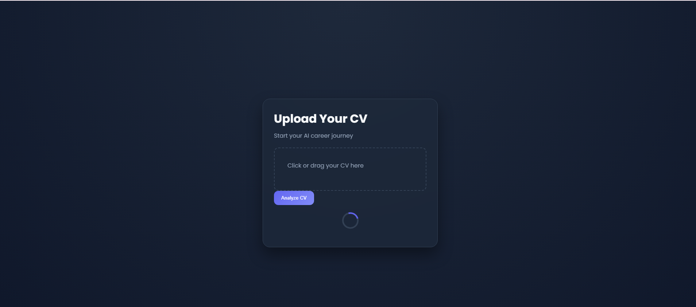
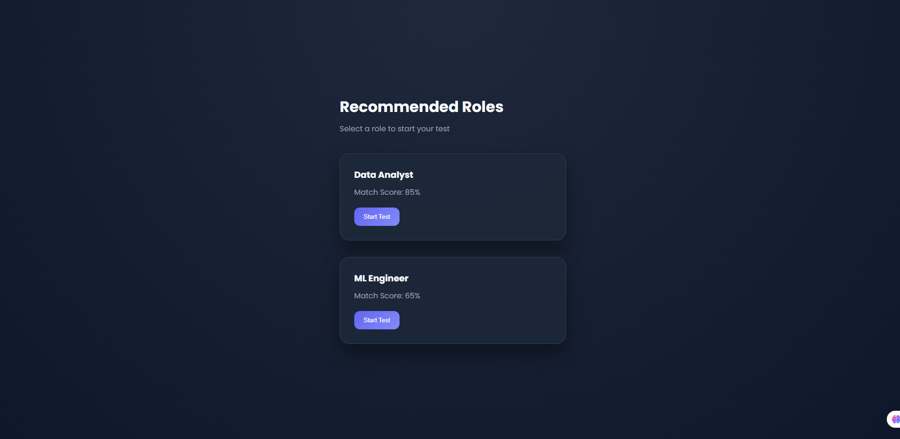
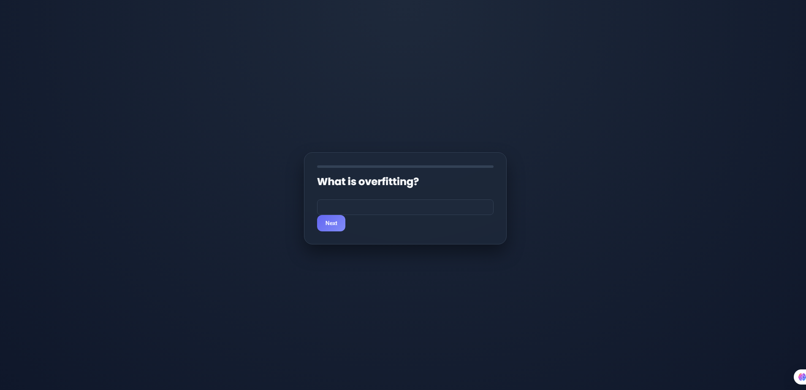
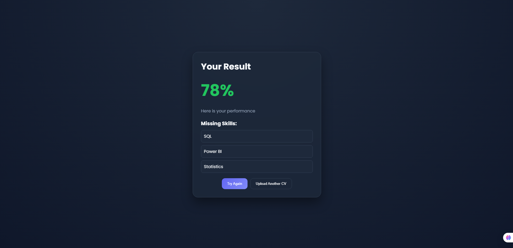

# 🚀 AI Career Assistant

An intelligent web application that analyzes your CV, recommends suitable roles, generates quizzes, and identifies skill gaps.

## 🔥 Features
- CV Parsing & Skill Extraction
- Role Recommendation (ML-based)
- AI-generated Quiz
- Answer Evaluation
- Skill Gap Analysis

## 🛠 Tech Stack
- HTML, CSS, JavaScript
- State Management (Custom)
- API Layer (Mock + Ready for Backend)

## 🎯 Project Flow
1. Upload CV
2. Get recommended roles
3. Take quiz
4. Get score & gaps

## 📸 Screenshots

### 📄 Upload

### 🎯 Roles

### 🧠 Quiz

### 📊 Result

## 🚀 Live Demo
(https://ai-career-assistant-sultan.netlify.app/)

## 💡 Future Work
- Real Backend Integration
- Voice Interview
- Course Recommendations